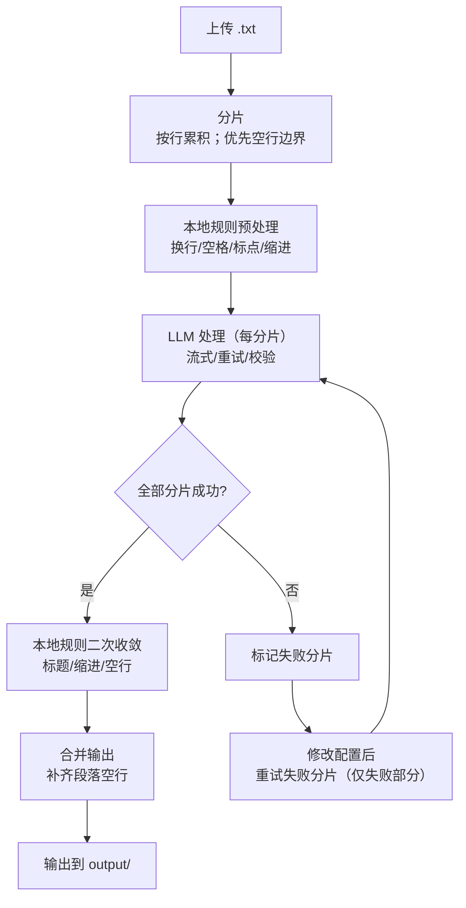

<div align="center">


[](https://python.org)
[](requirements.txt)
[](LICENSE)

</div>

## 功能概述

| 功能     | 说明                                         |
| -------- | -------------------------------------------- |
| 本地排版 | 修正缩进、空行、标点符号                     |
| LLM 辅助 | 接入 OpenAI-compatible 处理复杂标点          |
| 并发处理 | 大文件分片多线程处理                         |
| 失败重试 | 分片失败后可修改配置并重试，成功后再合并输出 |

校对前后对比：

<div align="center">

</div>

## 快速启动

```bash
# 一键启动
start.bat

# 或手动执行
python -m venv .venv
.venv\Scripts\activate
pip install -r requirements.txt
python -m novel_proofer.server
```

启动后访问 http://127.0.0.1:18080

## 处理流程



## 文档

| 文档 | 说明 |
|------|------|
| [使用指南](docs/USAGE.md) | 安装配置、规则说明、异常处理、调试方法 |
| [技术架构](docs/ARCHITECTURE.md) | 系统设计原理（Why + How） |
| [测试用例](docs/TESTCASES.md) | 测试覆盖说明 |

## 已知问题

- 偶尔出现乱码，经检查原文件并无乱码

## 待办

- [ ] 识别原文件不同编码格式并最终统一为 UTF-8
- [ ] 补充 LLM 边缘情况的单元测试
