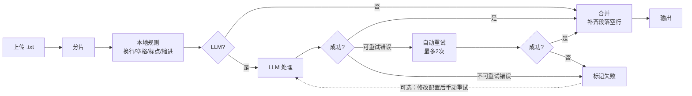

<div align="center">


[](https://python.org)
[](requirements.txt)
[](LICENSE)

</div>


## 功能概述

校对前后对比：
<div align="center">

</div>

核心功能一览：
| 功能     | 说明                                                            |
| -------- | --------------------------------------------------------------- |
| 本地排版 | 修正缩进、空行、标点符号                                        |
| LLM 辅助 | 可选接入 OpenAI-compatible 处理复杂标点                         |
| 并发处理 | 大文件分片多线程处理                                            |
| 失败重试 | LLM 分片失败后可修改配置并重试失败分片，全部成功后再合并输出    |
| 输出校验 | 当分片输出明显过短/过长时会标记失败，便于换模型/配置后重试      |
| 本地运行 | 关闭 LLM 时无外部传输；启用 LLM 会把文本发送到你配置的 LLM 服务 |

设计原则：只做排版，不改内容。


## 安装与启动

双击 `start.bat` 启动，或手动执行以下命令：

```bash
python -m venv .venv
.venv\Scripts\activate
pip install -r requirements.txt
python -m novel_proofer.server
```

启动后访问 http://127.0.0.1:18080 。

上传 `.txt` 文件后系统自动执行排版处理。全部成功时，最终结果输出到 `output/` 目录；部分失败时，可修改 LLM 配置后点击「重试失败部分」，全部成功后才会生成最终输出文件。若输出明显异常（过短或过长），该分片会标记失败，建议更换模型或调整输出上限后重试。


## 处理流程




## 本地校对规则

本地规则在 `novel_proofer/formatting/rules.py` 中实现，按顺序依次执行：

| 规则         | 实现逻辑                                                                           |
| ------------ | ---------------------------------------------------------------------------------- |
| 换行符统一   | `\r\n` 和 `\r` 全部替换为 `\n`                                                     |
| 行尾空格清理 | 正则 `[ \t]+(?=\n)` 移除行尾空白                                                   |
| 空行规范化   | 连续 4+ 空行压缩为 2 空行                                                          |
| 省略号统一   | `...`、`。。。` 等统一为 `……`（两个 U+2026）                                       |
| 破折号统一   | `--`、`——` 等统一为 `——`（两个 U+2014）                                            |
| 中文标点转换 | 仅在 CJK 上下文中将 ASCII 标点转为全角（如 `,` → `，`），跳过数字场景（如 `3.14`） |
| 标点间距修复 | 移除汉字与标点之间的多余空格                                                       |
| 引号规范化   | 偶数 `"` 的行转换为 `""`，仅处理含 CJK 字符的行                                    |
| 段落缩进     | 正文段落添加两个全角空格缩进，章节标题不缩进                                       |


## LLM 校对模块

本地规则是确定性的字符替换，无法理解语义。LLM 用于处理本地规则难以判断的场景：对话与叙述的分段、场景转换的段落分隔、章节标题格式调整、以及复杂标点上下文的修正。LLM 使用的系统提示词定义在 `novel_proofer/llm/config.py` 中。

处理流程为：输入文本 → 按段落边界分片 → 本地规则预处理 → LLM 流式请求 → 输出校验 → 合并输出。

支持的 LLM 端点：OpenAI-compatible（`{base_url}/v1/chat/completions`，SSE 流式）。


## 异常处理与校验

HTTP 错误重试：状态码 408、409、425、429、500、502、503、504 会自动重试（最多 2 次，指数退避）。其他状态码（如 401、403）立即报错，不重试。

输出校验：LLM 返回后进行长度校验以防止内容丢失。输出为空时报告 token 限制或流解析问题；输入 ≥200 字符时，若输出/输入比值 < 0.85 则判定过短，> 1.15 则判定过长，均标记为失败。

合并输出：合并分片输出时会统一换行符，并在相邻非空行之间补齐一个空行，避免分片边界丢失段落分隔；同时保留分片内的原始空行。

Think 标签过滤：部分模型（如 DeepSeek）会输出 `<think>...</think>` 推理过程。启用过滤后使用状态机流式过滤，支持跨 chunk 边界；若检测到未闭合标签，回退为仅移除标签标记、保留内容。


## 调试信息

每个任务在 `output/.jobs/{job_id}/` 下保存中间文件，用于排查与重试。默认情况下任务全部成功后会自动删除该目录；如需保留可在 UI 取消勾选「完成后删除调试中间文件」；任务失败时不会自动删除，可在 UI 点击「清理中间文件」手动删除。

目录结构如下：

```
output/.jobs/{job_id}/
├── README.txt
├── pre/{index:06d}.txt   # 发送给 LLM 的分片输入
├── out/{index:06d}.txt   # 分片最终输出（通过校验）
└── resp/{index:06d}.txt  # LLM 原始响应（覆盖式）
```

UI 调试面板位于「分析进度」标签页，提供统计栏（总计/完成/错误/重试中分片数）、过滤器（全部/仅错误/仅重试）、以及分片表格（状态、重试次数、输入输出字符数、错误信息）。分片状态包括 `pending`（等待处理）、`processing`（正在请求）、`retrying`（等待重试）、`done`（处理完成）、`error`（处理失败）。


## 开发与测试

安装开发依赖：

```bash
pip install -r requirements-dev.txt
```

运行测试：

```bash
pytest -q
```

Windows 一键自检：

```bash
start.bat --smoke
```


## 已知问题

偶尔出现乱码，经检查原文件并无乱码。


## 待办事项

[] 识别原文件不同编码格式并最终统一为 UTF-8。
