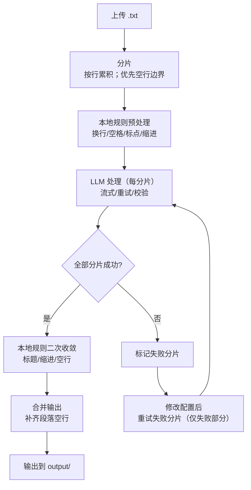

<p align="center">
  
  <h1 align="center">Novel Proofer</h1>
  <h4 align="center">小说打样员 - 中文涩涩小说排版校对</h4>
</p>

<p align="center">
  
  
  
  
</p>

## Introduction

`Novel Proofer` 是一个中文小说排版校对工具，结合本地确定性规则与 LLM 语义理解，自动处理标点符号、段落缩进、空行规范等排版问题。支持大文件分片并发处理，失败分片可单独重试，无需重新上传。

## Features

- 😎 自动修正缩进、空行、标点符号（中英文标点转换、省略号、破折号等）
- 👻 接入 LLM 辅助处理处理复杂标点和段落分割
- ✂️ 大文件自动按行边界分片，多线程并发处理
- 🔗 失败分片可修改 LLM 配置后单独重试，成功后再合并输出
- 📌 LLM 配置支持"保存默认"，写入本地 `.env` 并自动预填
- 🌀 支持"重跑全部（新任务）"，无需重新上传文件

**If you like this app, please consider giving it a [Star ⭐️](https://github.com/zhu-jl18/novel-proofer), thanks! (^-^)**


## Installation

### Configuration 

两种方式配置 LLM 默认参数：

1. 页面保存 - 填写 LLM 配置后点击「保存默认」，写入仓库根目录 `.env`，下次打开自动预填
2. 手动配置 - 复制 `.env.example` 为 `.env` 并填写


### Start the Server

Click the script or run in terminal:

```bash
# 一键启动
.\start.bat
```
> [!NOTE]
> `start.bat` 会自动创建并激活 `.venv` 虚拟环境，无需手动配置。
> 
Or Try manual installation and start：

```bash
python -m venv .venv
.venv\Scripts\activate
pip install -r requirements.txt
python -m novel_proofer.server
```

启动后访问 http://127.0.0.1:18080 即可使用。

## Usage

| Ways     | Description                                 | Preview                                   |
| -------- | ------------------------------------------- | ----------------------------------------- |
| 上传文件 | 选择 .txt 文件上传，自动识别 UTF-8/GBK 编码 | <!--  -->   |
| LLM 配置 | 填写 API 地址、Key、模型名，可保存为默认    | <!--  -->   |
| 处理进度 | 实时显示分片处理状态，支持暂停/继续/取消    | <!--  --> |
| 失败重试 | 修改配置后重试失败分片，无需重新上传        | <!--  -->    |

## Workflow



## Documentation

- 📖 [ Complete Usage Guide ](docs/USAGE.md) - 安装配置、规则说明、异常处理、调试方法
- 🔧 [Detailed Architecture Doc](docs/ARCHITECTURE.md) - 系统设计原理（Why + How）
- ⚔️ [Full Testcase Instructions](docs/TESTCASES.md) - 测试覆盖说明

## Known Issues

- 偶尔出现乱码，经检查原文件并无乱码

## Roadmap

- [ ] 识别原文件不同编码格式并最终统一为 UTF-8
- [ ] 补充 LLM 边缘情况的单元测试
