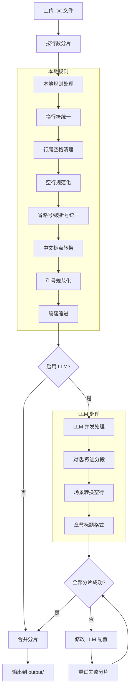

<div align="center">

# 小说排版校对器

**Novel Proofer**

中文网络小说 `.txt` 文件的排版与标点统一工具

[](https://python.org)
[](LICENSE)


</div>

---

## 效果对比

<div align="center">

</div>

---

## 功能

| 功能     | 说明                                |
| -------- | ----------------------------------- |
| 本地排版 | 修正缩进、空行、标点符号            |
| LLM 辅助 | 可选接入 OpenAI/Gemini 处理复杂标点 |
| 并发处理 | 大文件分片多线程处理                |
| 失败重试 | LLM 分片失败后可修改配置并重试失败分片，全部成功后再合并输出 |
| 本地运行 | 默认无外部数据传输                  |

> 原则：只做排版，不改内容

### 处理流程



---

## 快速开始

### Windows

双击 `start.bat`

## 手动运行

```bash
# 创建虚拟环境
python -m venv .venv
.venv\Scripts\activate

# 安装依赖
pip install -r requirements.txt

# 启动
python -m novel_proofer.server
```

访问 http://127.0.0.1:18080

---

## 使用流程

```
上传 .txt 文件 → 自动排版处理

- 全部成功：最终结果输出到 output/
- 部分失败：可修改 LLM 配置后点击“重试失败部分”，全部成功后才会生成最终输出文件
```

---

## 已知问题

- 偶尔莫名出现乱码，经检查原文件并无乱码

---

## 待办

- [ ] 识别原文件不同编码格式并最终统一为 UTF-8

---

## 技术栈

```
Python 3 · http.server · ThreadPoolExecutor
```
