<p align="center">
  
  <h1 align="center">Novel Proofer</h1>
  <h4 align="center">帮你轻松校对中文涩涩小说</h4>
</p>

<p align="center">
  
  
  
  
</p>

## Novel Proofer

`Novel Proofer` 即“小说打样员”，是专为中文涩涩小说排版校对设计的工具。它帮助你轻松优雅地完成对涩涩小说的排版校对工作。

此工具的设计思路融合了基于确定性规则启发式的算法 和 LLM 强大的语义理解能力：首先对小说进行分片处理，通过启发式算法进行粗处理，随后交由LLM进行精细化调整，最后在本地二次校验并拼接完整输出。

**Recommended free api services**: [Cerebras](https://cloud.cerebras.ai/), [Nvidia](https://build.nvidia.com/) and [Juya 公益站](https://connect-with-me.com).

<!--  -->  
<!--  -->  


## Features

- 😎 自动修正缩进、空行、标点符号（中英文标点转换、省略号、破折号等）
- 👻 接入 LLM 辅助处理处理复杂标点和段落分割
- ✂️ 大文件自动按行边界分片，多线程并发处理
- 🔗 失败分片可修改 LLM 配置后单独重试，成功后再合并输出
- 📌 LLM 配置支持"保存默认"，写入本地 `.env` 并自动预填
- 🌀 支持"重跑全部（新任务）"，无需重新上传文件

**If you like this app, please consider giving it a [Star](https://github.com/zhu-jl18/novel-proofer) ⭐️, thanks! (^-^)**


## Installation

### 1. Configuration 

手动配置： 复制 `.env.example` 为 `.env` 并填写：

```bash
cp .env.example .env
```

或启动服务后在 Web UI 填写 LLM 配置后点击「保存默认」，会写入仓库根目录 `.env`，下次打开自动预填。

### 2. Start the Server

Windows（推荐）：

```bat
.\start.bat
```
> [!NOTE]
> `start.bat` / `start.sh` 会优先使用 `uv`（如果已安装，会读取 `pyproject.toml` + `uv.lock`）；否则回退到创建 `.venv` 并从 `requirements.lock.txt` 安装依赖。


WSL2 / Linux / macOS：

```bash
bash start.sh
# or: ./start.sh
```
> [!NOTE]
> 如果你是从 Windows 直接把整个项目文件夹复制到 WSL2，并把 `.venv/` 也一起复制过来：那个 `.venv` 是 Windows 专用的，WSL2 下不能用。`start.sh` 会自动把它移到 `.venv.win*` 并重新创建 Linux venv。

Try manual installation and start alternatively:

uv（推荐，跨平台）：

```bash
uv sync --frozen --no-install-project --no-dev
uv run --frozen --no-sync -m novel_proofer.server
```

pip（fallback）：

Windows：

```bat
python -m venv .venv
.venv\Scripts\activate
pip install -r requirements.lock.txt
python -m novel_proofer.server
```

WSL2 / Linux / macOS：

```bash
python3 -m venv .venv
source .venv/bin/activate
pip install -r requirements.lock.txt
python -m novel_proofer.server
```

启动后访问 http://127.0.0.1:18080 即可使用。

## Usage

| Ways     | Description                                 | Preview                                   |
| -------- | ------------------------------------------- | ----------------------------------------- |
| 上传文件 | 选择 .txt 文件上传，自动识别 UTF-8/GBK 编码 | <!--  -->   |
| LLM 配置 | 填写 API 地址、Key、模型名，可保存为默认    |          |
| 处理进度 | 实时显示分片处理状态，支持暂停/继续/删除任务 | <!--  --> |
| 失败重试 | 修改配置后重试失败分片，无需重新上传        | <!--  -->    |

## Workflow

```mermaid
flowchart TD
    A[上传 .txt] --> B[分片<br/>按行累积；优先空行边界]
    B --> C[本地规则预处理<br/>换行/空格/标点/缩进]
    C --> E[LLM 处理（每分片）<br/>流式/重试/校验]
    E --> H{全部分片成功?}
    H -->|是| P[本地规则二次收敛<br/>标题/缩进/空行]
    P --> F[合并输出<br/>补齐段落空行]
    F --> G[输出到 output/]
    H -->|否| M[标记失败分片]
    M --> R[修改配置后<br/>重试失败分片（仅失败部分）]
    R --> E
```



## Documentation

- 📖 [Complete Usage Guide](docs/USAGE.md) - 安装配置、规则说明、异常处理、调试方法
- 🧭 [Workflow & Recovery](docs/WORKFLOW.md) - 三阶段流程、任务恢复/重新关联、按钮语义
- 🧠 [State Machine](docs/STATE_MACHINE.md) - `state/phase/chunk` 的语义与状态转移
- 🔧 [Detailed Architecture Doc](docs/ARCHITECTURE.md) - 系统设计原理（Why + How）
- 🚀 [Performance Notes](docs/PERFORMANCE.md) - 热点定位、优化策略与基准结果
- ⚔️ [Full Testcase Instructions](docs/TESTCASES.md) 
- 🧑‍💻 [Development Guide](docs/DEVELOP.md) - 协作开发约定（分支/提交/测试/Hook）

## Issues

为了便于自动化处理（含 `gh`/AI 读取），本项目对 Issue 标题做了硬性约定：

- `[Bug] ...`
- `[Feature] ...`
- `[Suggestion] ...`
- `[General] ...`（不确定选哪个就用这个）

不符合该格式的 Issue 会被机器人自动关闭；请改好标题后重新打开即可。优先级用 labels（`P0/P1/P2/P3`）表达。


## Known Issues

- 偶尔出现乱码，经检查原文件并无乱码
