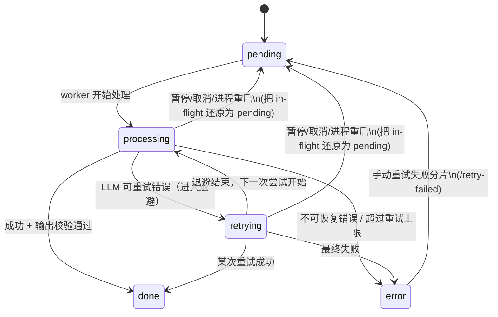
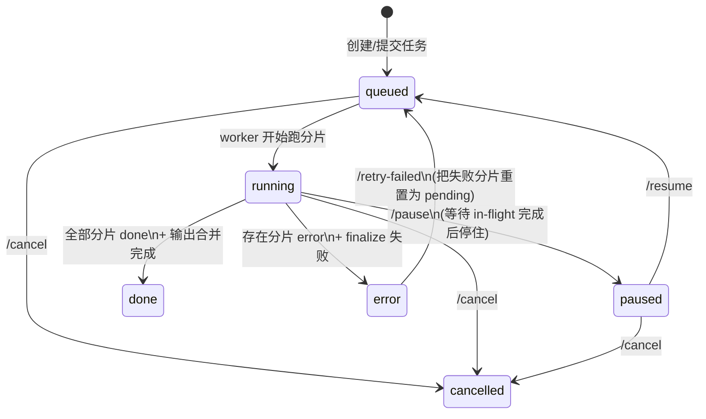

# 状态机：Job / Chunk 状态转移（含重试语义）

本文描述 novel-proofer 的两层状态机：

- **Job 状态**：一个任务整体的生命周期（`queued|running|paused|done|error|cancelled`）。
- **Chunk 状态**：任务内每个分片的生命周期（`pending|processing|retrying|done|error`）。

> 设计原则：`retrying` **不是**“待重试队列”，而是**同一次分片处理内部**的“自动重试/退避等待”中间态；手动“重试失败分片”应当把分片重置为 `pending` 再重新调度。

## Chunk 状态机

### 状态语义

- `pending`：待处理（已入队/可被 worker 调度），尚未开始本次尝试。
- `processing`：worker 正在处理该分片（读写文件、发起 LLM 请求、校验输出等）。
- `retrying`：LLM 请求发生可重试错误（如 429/504 等）后，正在退避等待下一次尝试；会伴随 `retries` 递增与 `last_error_*` 更新。
- `done`：该分片处理成功（输出通过校验并落盘）。
- `error`：该分片处理失败（达到重试上限或不可重试错误/本地异常）。

### Mermaid（Chunk）

### 关键字段（Chunk）

- `retries`：自动重试计数（只在 LLM 请求链路中递增）。
- `last_error_code` / `last_error_message`：最近一次失败的诊断信息（**完成后可能保留历史错误**，UI 应把它当作“曾重试/历史信息”而非“当前错误”）。
- `llm_model`：该分片**最近一次处理/即将进行的处理**所使用的模型名（便于排查“失败分片重试时换模型”的混用问题）。

## Job 状态机

### 状态语义

- `queued`：已提交任务/准备开始（等待后台线程池调度）。
- `running`：正在处理（worker 池在跑分片）。
- `paused`：已暂停（等待 in-flight 完全落地后停住；可继续恢复）。
- `error`：任务失败（存在 `chunk=error`，需要调整 LLM 配置后重试失败部分）。
- `done`：任务完成（输出已合并生成）。
- `cancelled`：任务已取消（尽快停止调度并落地可恢复状态）。

### Mermaid（Job）

### 关键字段（Job）

- `progress.total_chunks` / `progress.done_chunks`：进度与百分比展示的基准。
- `last_retry_count`：全任务范围的自动重试总次数（统计/观测用）。
- `last_llm_model`（API 里暴露为 `job.llm_model`）：**本轮/最近一次**执行所用模型名（配合每个分片的 `llm_model` 进行定位）。

## UI 展示约定（推荐）

- `retrying` 在**展示层**应视为 `processing` 的子状态：进度条与“处理中”统计/过滤可把 `processing + retrying` 合并为 “Active/处理中”。
- 表格行内仍保留诊断能力：通过 `重试次数` 与 `信息(last_error_*)` 表达“正在重试/曾重试/最终错误”。

