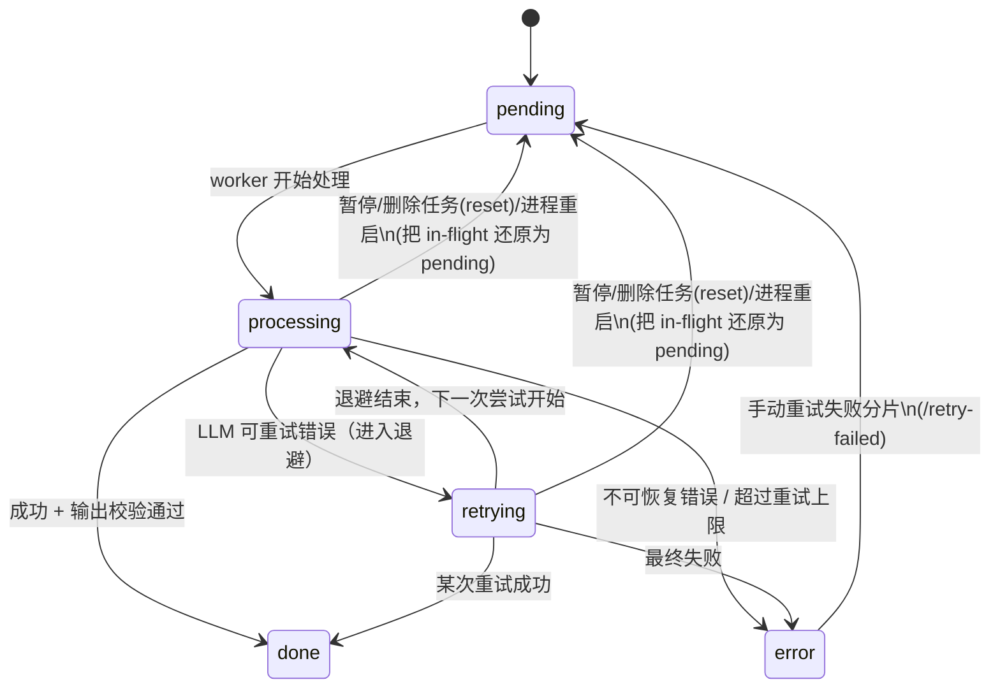
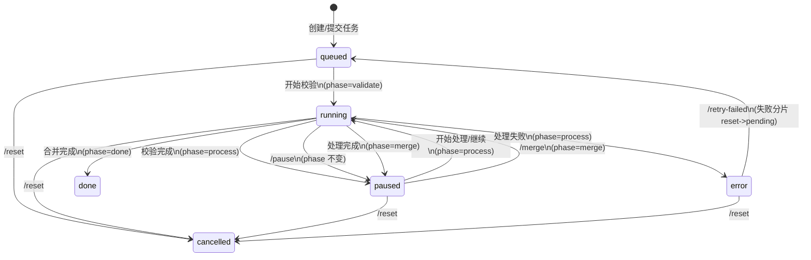

# 状态机：Job / Phase / Chunk（含重试语义）

本文描述 novel-proofer 的三层状态模型：

- **Job 运行态（`job.state`）**：一个任务整体的生命周期（`queued|running|paused|done|error|cancelled`）。
- **Job 阶段（`job.phase`）**：任务处于哪一段 workflow（`validate|process|merge|done`）。
- **Chunk 状态**：任务内每个分片的生命周期（`pending|processing|retrying|done|error`）。

> 设计原则：`retrying` **不是**“待重试队列”，而是**同一次分片处理内部**的“自动重试/退避等待”中间态；手动“重试失败分片”应当把分片重置为 `pending` 再重新调度。

## Chunk 状态机

### 状态语义

- `pending`：待处理（已入队/可被 worker 调度），尚未开始本次尝试。
- `processing`：worker 正在处理该分片（读写文件、发起 LLM 请求、校验输出等）。
- `retrying`：LLM 请求发生可重试错误（如 429/504 等）后，正在退避等待下一次尝试；会伴随 `retries` 递增与 `last_error_*` 更新。
- `done`：该分片处理成功（输出通过校验并落盘）。
- `error`：该分片处理失败（达到重试上限或不可重试错误/本地异常）。

### Mermaid（Chunk）

### 关键字段（Chunk）

- `retries`：自动重试计数（只在 LLM 请求链路中递增）。
- `last_error_code` / `last_error_message`：最近一次失败的诊断信息（**完成后可能保留历史错误**，UI 应把它当作“曾重试/历史信息”而非“当前错误”）。
- `llm_model`：该分片**最近一次处理/即将进行的处理**所使用的模型名（便于排查“失败分片重试时换模型”的混用问题）。

## Job 状态机

### Job 阶段语义（`job.phase`）

- `validate`：校验/准备阶段：解码、切片、确定性规则预处理，生成可恢复中间态（`pre/` 等）。
- `process`：处理阶段：对 chunk 发起 LLM 请求与校验，写入 `out/`；`resp/` 为可选调试产物（默认仅失败写入，或显式开启“全量保留 raw 响应”时写入）；失败支持自动重试与手动重试失败分片。
- `merge`：合并阶段：所有 chunk 成功后，等待用户显式点击“合并输出”。
- `done`：完成：已合并生成最终输出文件。

### Job 运行态语义（`job.state`）

- `queued`：已提交任务/准备开始（等待后台线程池调度）。
- `running`：正在运行（校验/处理/合并任一阶段的后台任务正在执行）。
- `paused`：已暂停/待用户操作：用于表示“可恢复且当前未运行”。
- `error`：任务失败（通常是处理阶段存在 `chunk=error`；或合并阶段异常）。
- `done`：任务完成（已合并生成输出）。
- `cancelled`：仅用于“删除任务（reset）”的硬删除信号，通常会很快被清理并从 jobs 列表消失；UI 不应把它当作可恢复状态。

### Mermaid（Job）

### 关键字段（Job）

- `progress.total_chunks` / `progress.done_chunks`：进度与百分比展示的基准。
- `last_retry_count`：全任务范围的自动重试总次数（统计/观测用）。
- `last_llm_model`（API 里暴露为 `job.llm_model`）：**本轮/最近一次**执行所用模型名（配合每个分片的 `llm_model` 进行定位）。

## UI 展示约定（推荐）

- `retrying` 在**展示层**应视为 `processing` 的子状态：进度条与“处理中”统计/过滤可把 `processing + retrying` 合并为 “Active/处理中”。
- 表格行内仍保留诊断能力：通过 `重试次数` 与 `信息(last_error_*)` 表达“正在重试/曾重试/最终错误”。
- 主流程按钮推荐按 `job.phase` 呈现为：**开始校验 / 开始处理 / 合并输出**；并将“新任务（detach）”与“删除任务（reset）”区分（校对进行中建议先“暂停”再执行这两类操作）。
- 为避免页面关闭/刷新导致 LLM 继续运行消耗时间/费用，UI 可在退出时 best-effort 调用一次 `/pause`（仅对 `phase=process` 生效）。
