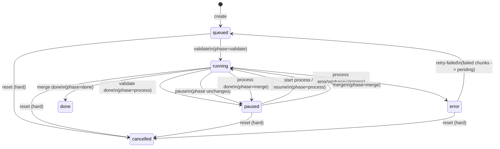
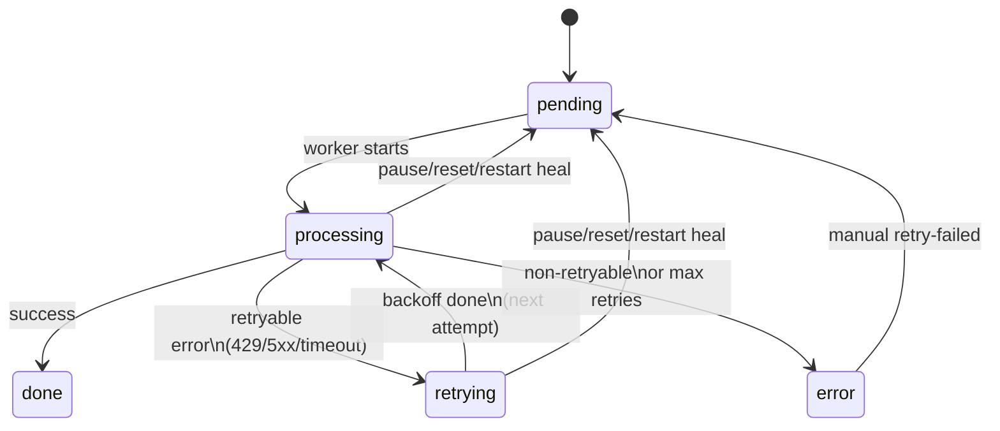
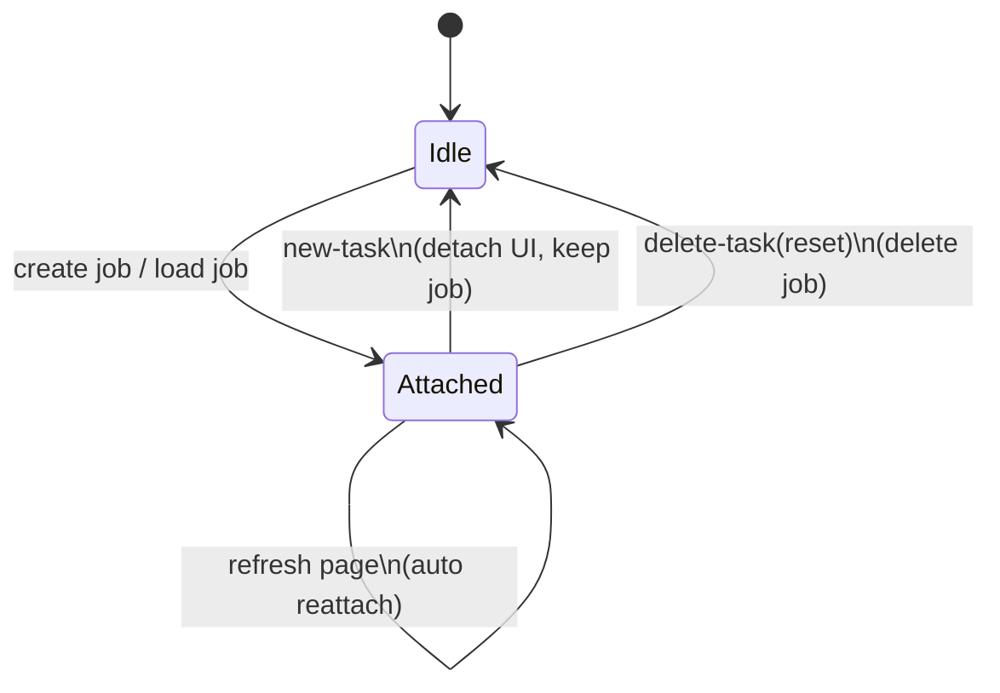

# Workflow：三阶段流程与任务恢复（Mermaid）

本文面向“用户心智模型 + 排障”，描述三阶段工作流的状态转移与 UI attach（重新关联任务）行为。

## 1) 三阶段（Validate → Process → Merge）

- **校验（validate）**：解码、切片、确定性规则预处理，产出可恢复中间态（`output/.jobs/<job_id>/pre/`）。  
- **处理（process）**：对 chunk 发起 LLM 请求与输出校验，写入 `out/`；`resp/` 为可选调试产物（默认仅失败写入，或显式开启“全量保留 raw 响应”时写入）；支持自动重试与手动重试失败分片。  
- **合并（merge）**：所有 chunk 成功后，用户显式点击“合并输出”生成最终文件（可选清理中间产物）。

## 2) Job 生命周期（`state + phase`）

## 3) Chunk 生命周期（含 retrying）

> `retrying` 表示**同一次分片处理内**的自动重试/退避等待，不是“待重试队列”。

## 4) UI attach 状态（不等同于 Job state）

UI 维护“是否已连接某个 job”的概念（例如 localStorage 保存上次 `job_id`），用于解决刷新/关闭页面后的状态丢失：

## 5) 暂停 / 新任务 / 删除任务（按钮语义）

- **暂停**：停止当前执行并把 job 留在可恢复状态（通常为 `paused`）。主要用于 LLM 校对阶段，避免后台继续消耗时间/费用。
- **新任务**：仅 UI 解除关联，不删除、不停止 job；之后可通过“加载任务”继续/查看。
- **删除任务（reset）**：停止并删除该 job 的中间产物与持久化记录（不可恢复），UI 同样重置；不会删除 `output/` 下已生成的最终输出文件（如果存在）。
- **刷新/关闭页面**：若任务处于 LLM 校对阶段且仍在运行，UI 会 best-effort 触发一次“暂停”（浏览器/网络限制下不保证 100% 成功）。
